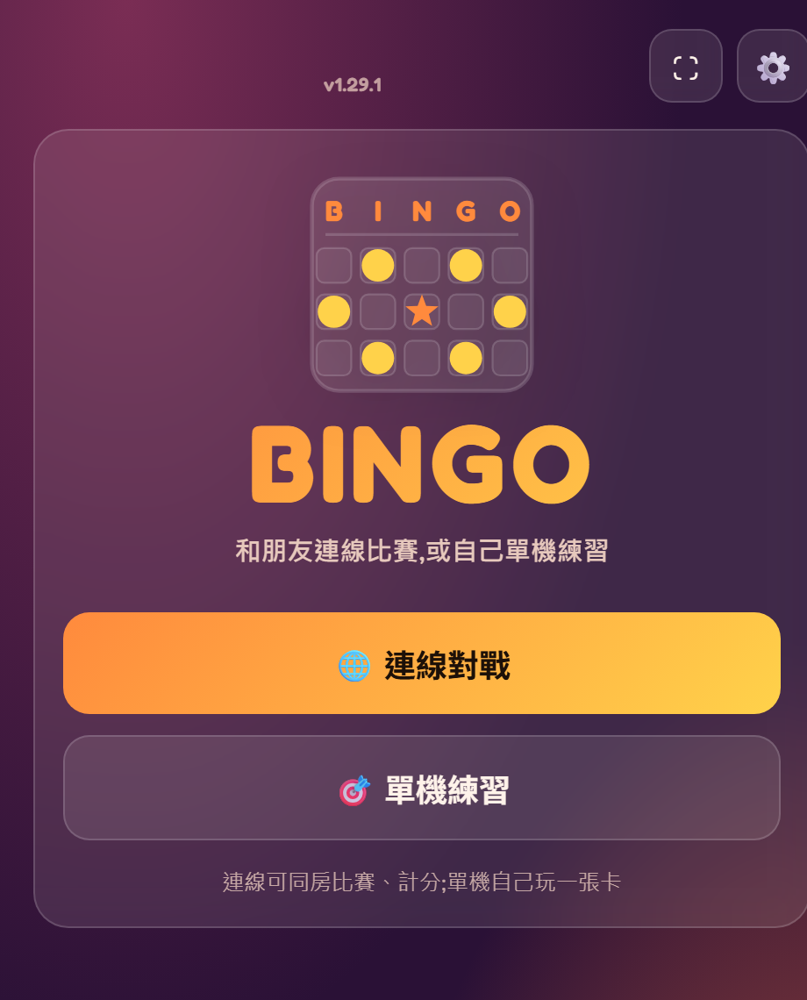
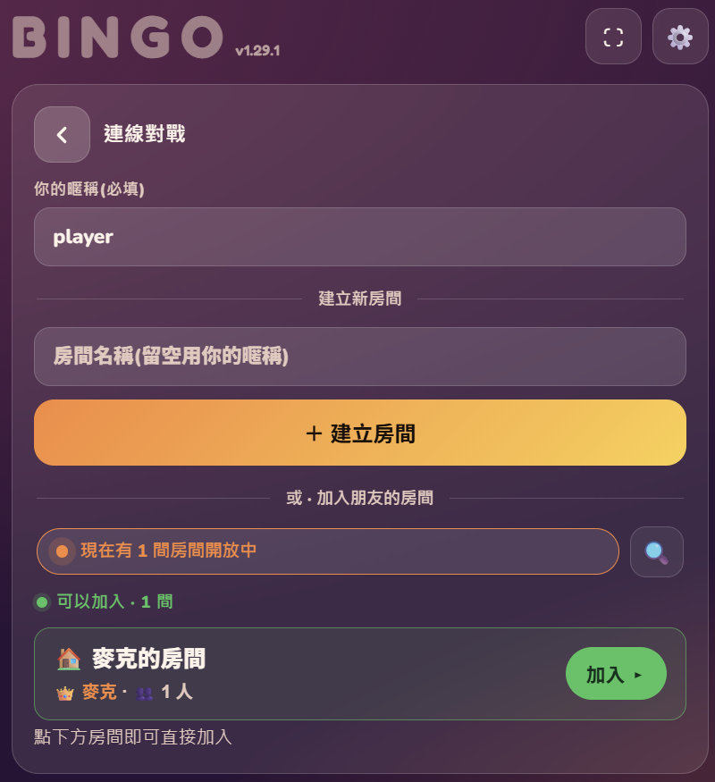
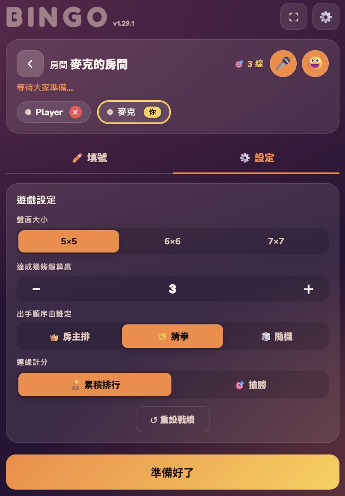
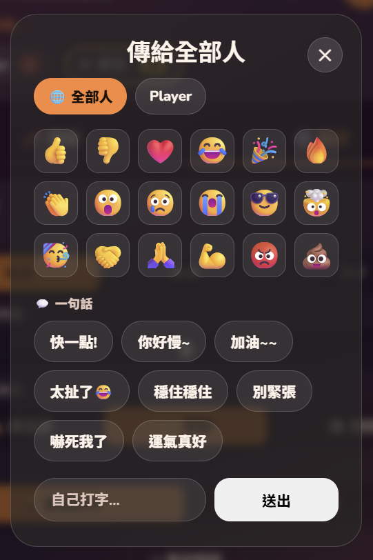
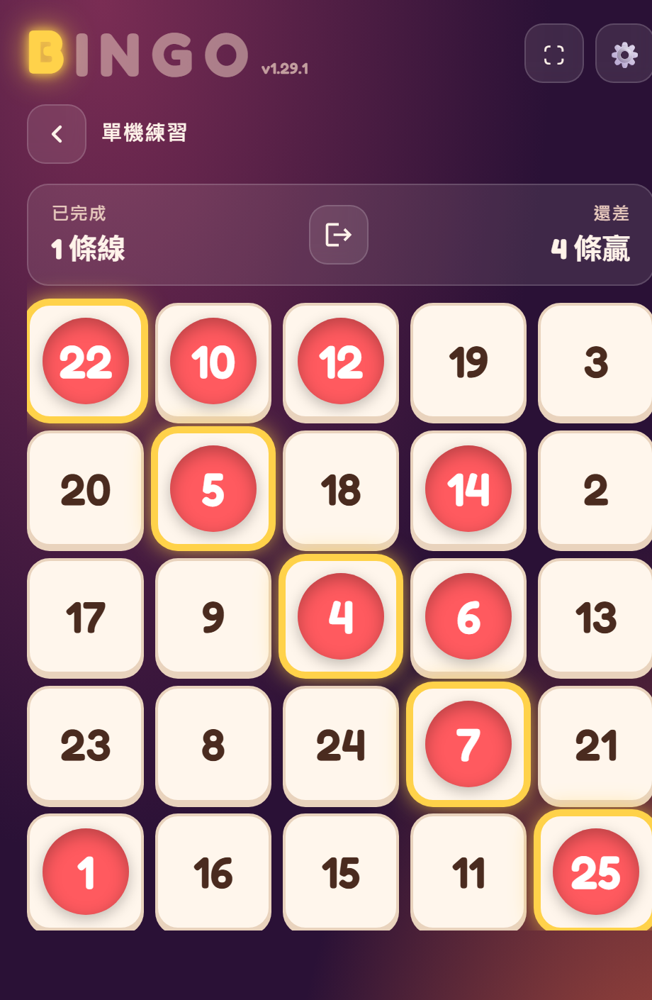
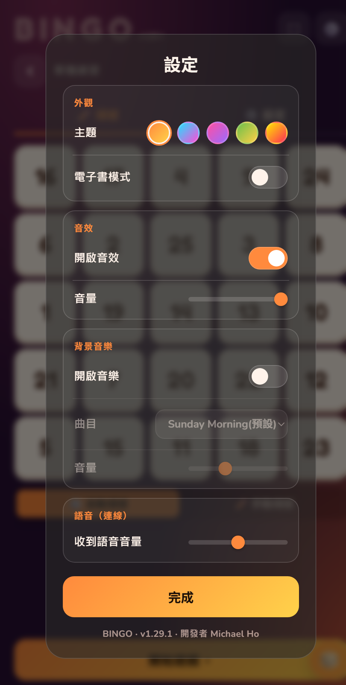
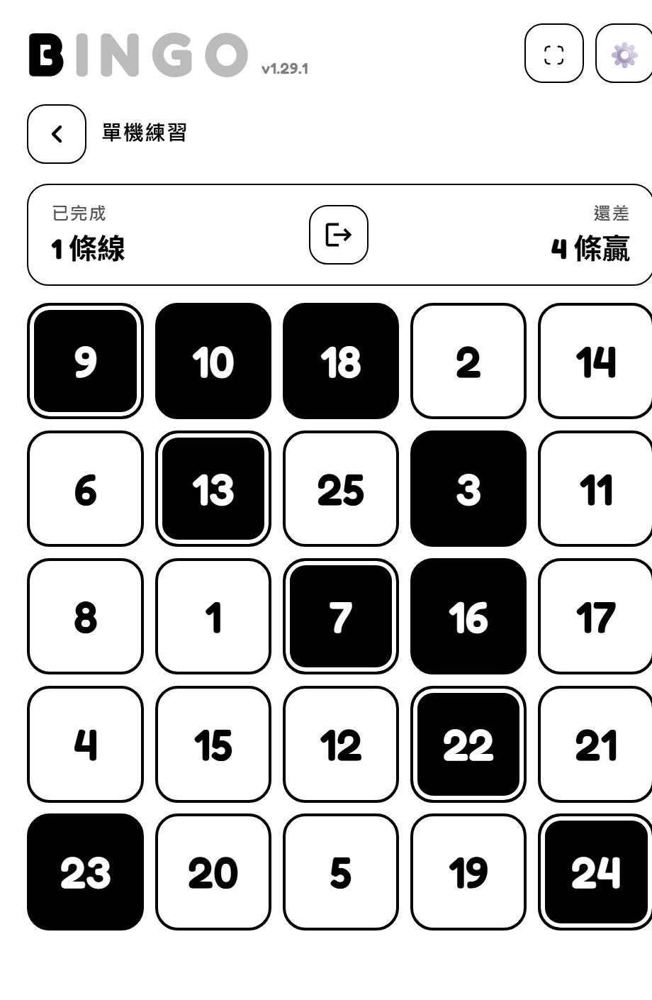

# 🎯 BINGO 賓果遊戲 ｜ 多人連線賓果對戰 (Online Multiplayer Bingo)

**主打多人連線對戰**的賓果遊戲網頁：開一間房，朋友用手機掃到就能加入，大家**輪流叫號**、比誰先連線、還能**猜拳定序**與**計分排名**，過程中還能互丟表情、傳語音。也內建單機練習模式。開瀏覽器就能玩，**免安裝、免下載**，手機、平板、電腦都適用。

> 適合：課堂帶動、公司尾牙 / 團康、家庭聚會、朋友同樂、直播互動。

**🌐 立即遊玩：** https://michaelho2520.github.io/Bingo/

  

---

## 📸 遊戲畫面

### 🌐 連線對戰（本作重點）

<table>
  <tr>
    <td align="center"><b>建立 / 加入房間</b></td>
    <td align="center"><b>房間大廳・對戰設定</b></td>
    <td align="center"><b>互動表情・訊息</b></td>
  </tr>
  <tr>
    <td></td>
    <td></td>
    <td></td>
  </tr>
</table>

### 🎯 單機練習 & 🎨 個人化

<table>
  <tr>
    <td align="center"><b>賓果盤面</b></td>
    <td align="center"><b>設定・主題・音樂</b></td>
    <td align="center"><b>電子書黑白模式</b></td>
  </tr>
  <tr>
    <td></td>
    <td></td>
    <td></td>
  </tr>
</table>

---

## ✨ 功能介紹

### 🌐 連線對戰（多人同樂，主打玩法）

- **開房 / 加入超簡單**：建立一間房、取個房名，朋友從房間列表**一鍵加入**，不必記房號。
- **輪流手動叫號**：採台灣課堂賓果玩法——輪到你才能叫號，叫出的號碼**全場即時同步劃記**，公平又有節奏；輪到誰一目了然。
- **出手順序自由決定**：✊ 猜拳、👑 房主指定、🎲 隨機三選一。
- **計分系統**：🏆 累積勝場排行，或 🎯「搶 N 勝奪冠」賽季制，連玩多局分數照樣累積。
- **房主管理**：房主可移出玩家、重設戰績、開新賽季。
- **斷線自動復原**：手機切到其他 App、短暫斷網都不會掉出房間，回來自動歸位、分數不歸零。

### 💬 即時互動（連線中）

- **互動表情**：對全場或指定某人送出趣味表情，畫面上會飛出來。
- **一句話訊息**：內建罐頭短語（「加油～」「穩住穩住」「太扯了 😂」…），也能自己打字送出。
- **語音留言**：直接錄一段語音送給全部人，現場氣氛更熱鬧。

### 🎯 單機練習

一個人一張卡，自己點號碼練手感、湊連線，隨時開一局，適合暖身或教學示範。

### 🧩 賓果玩法（連線 / 單機共用）

- **可選盤面大小**：5×5（號碼 1–25）、6×6（1–36）、7×7（1–49）。
- **自訂勝利條件**：自己決定湊滿 **幾條線**（橫、直、斜）算贏；盤面越大、可設定的線數上限越高。
- **填號方式任選**：🎲 自動隨機填號，或 ✏️ 自己手動填號；一鍵「換一組號碼」重抽整張卡。

### 🎨 個人化與體驗

- **六種主題**：五種繽紛配色 ＋ 一種「**電子書 / 電子紙**」黑白扁平模式（省電、護眼）。
- **音效**：即時合成的清脆音效，音量可調，含勝利 / 落敗音效。
- **背景音樂**：可開關、可選曲目、可調音量。
- **語音音量**：收到別人的語音留言時可自行放大 / 縮小。
- **全螢幕模式**：一鍵沉浸，適合投影到大螢幕帶全場玩。
- **PWA 支援**：可「加到主畫面」像 App 一樣開，並支援離線遊玩。
- **記住你的偏好**：主題、音效、音樂等設定自動保存，下次打開照舊。

---

## 🕹️ 怎麼玩

1. 打開網頁，選 **🌐 連線對戰**（多人）或 **🎯 單機練習**。
2. 連線模式：輸入暱稱 → **建立房間** 或 **加入朋友的房間**。
3. 房主設定盤面大小、勝利線數、出手順序與計分方式，大家按「準備好了」。
4. 依順序**輪流叫號**，號碼全場同步；最先湊滿指定連線數的人 **BINGO！** 🎉

---

## 🔖 關於

- **技術**：純 HTML / CSS / JavaScript 前端網頁，多人連線採用 Firebase Realtime Database，無需後端伺服器、無需安裝任何東西。
- **關鍵字**：賓果 / Bingo / 線上賓果 / 多人賓果 / 連線對戰 / 連線遊戲 / 團康遊戲 / 課堂遊戲 / 尾牙遊戲 / online bingo / multiplayer bingo game / party game。

Made with ❤️ by Michael Ho
