# 🎉 派對遊戲 ｜ 十二款多人連線遊戲（Online Multiplayer Party Games）

一個網址、**十二款遊戲**：賓果、五子棋、數獨、麻將消消樂、台灣 16 張麻將、排七、大老二、台式 21 點、UNO、象棋暗棋、成語接龍、你畫我猜。

**開一間房，朋友用手機點進來就能加入** —— 不必記房號、不必註冊、不必安裝。大部分遊戲也能一個人**離線單機**玩（多數配有電腦對手）。手機、平板、電腦都適用。

> 適合：家庭聚會、朋友同樂、公司尾牙 / 團康、課堂帶動、直播互動。

**🌐 立即遊玩：** https://michaelho2520.github.io/Bingo/

  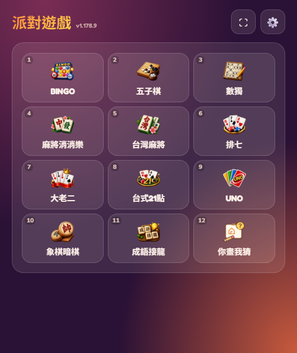

---

## 🎮 十二款遊戲

<table>
  <tr>
    <td align="center" width="25%"><b>🎲 BINGO</b> 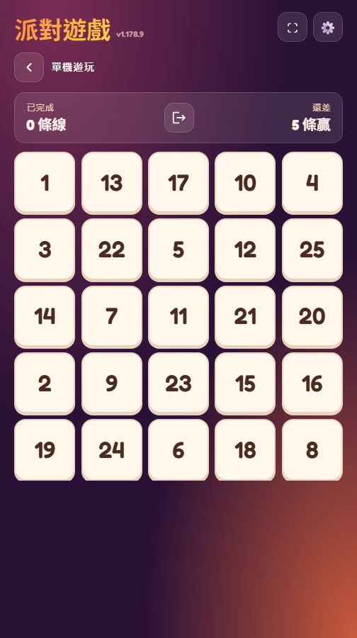</td>
    <td align="center" width="25%"><b>⚫ 五子棋</b> 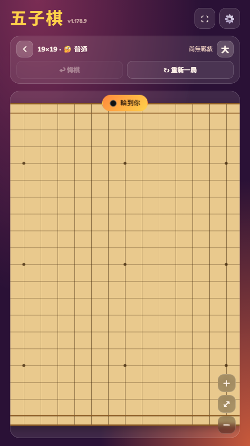</td>
    <td align="center" width="25%"><b>🔢 數獨</b> 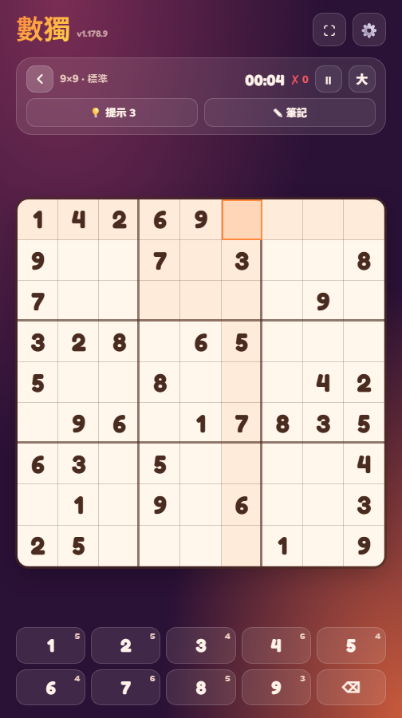</td>
    <td align="center" width="25%"><b>🀄 麻將消消樂</b> 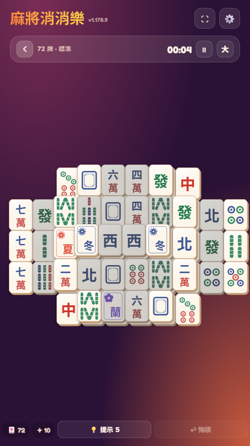</td>
  </tr>
  <tr>
    <td align="center"><b>🀄 台灣麻將</b> 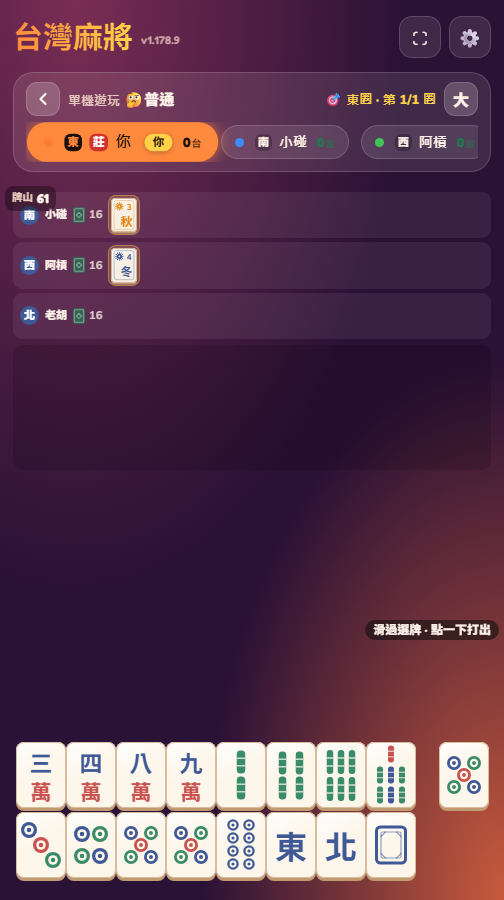</td>
    <td align="center"><b>♠︎ 排七</b> 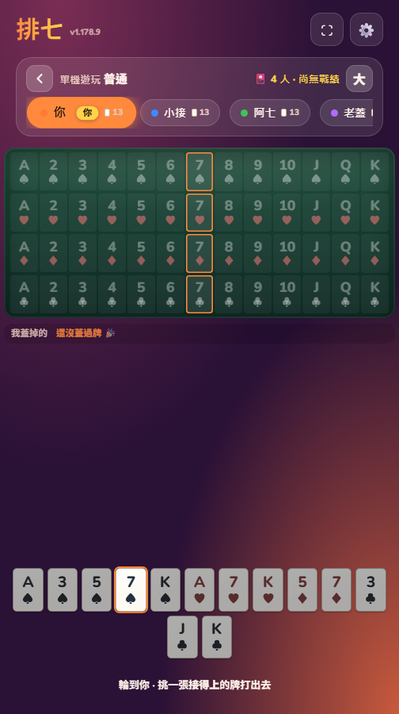</td>
    <td align="center"><b>♥︎ 大老二</b> 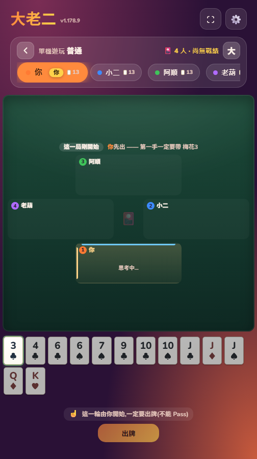</td>
    <td align="center"><b>♦︎ 台式21點</b> 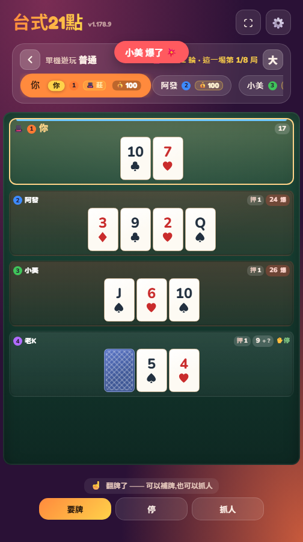</td>
  </tr>
  <tr>
    <td align="center"><b>🌈 UNO</b> 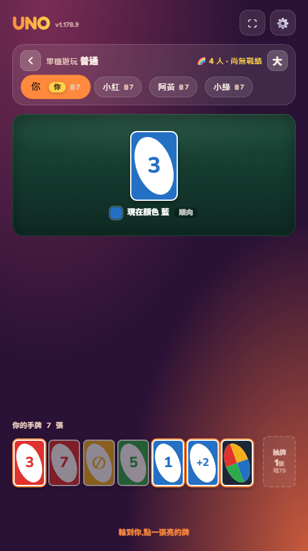</td>
    <td align="center"><b>🔴 象棋暗棋</b> 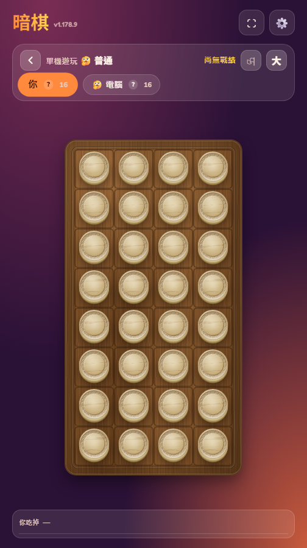</td>
    <td align="center"><b>🧩 成語接龍</b> 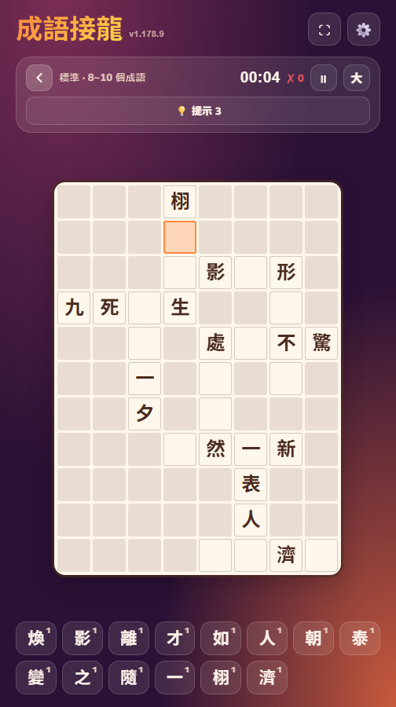</td>
    <td align="center"><b>🎨 你畫我猜</b> 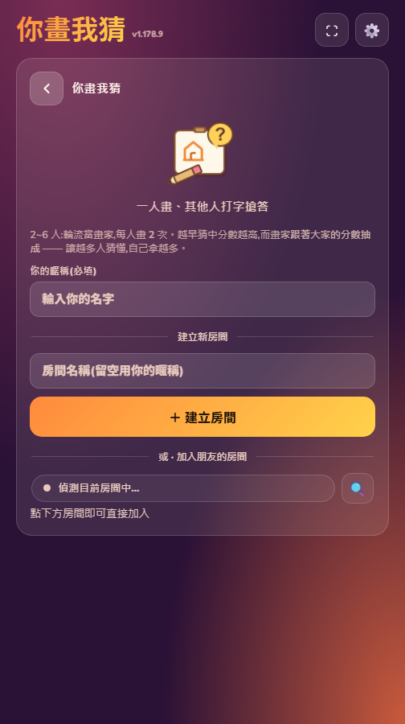</td>
  </tr>
</table>

每一款的玩法、可以幾個人一起玩、以及一個人能不能玩：

| 遊戲 | 玩法一句話 | 連線人數 | 一個人玩 |
| --- | --- | :---: | --- |
| 🎲 **BINGO** | 輪流叫號，號碼全場同步劃記，比誰先湊滿指定連線數 | 不限 | 單機練習 |
| ⚫ **五子棋** | 黑白輪流落子，五顆連成一線就贏 | 2 人 | 電腦對手 |
| 🔢 **數獨** | 連線有「搶格」與「競速」兩種賽制 | 2–6 人 | 單人解題 |
| 🀄 **麻將消消樂** | 配對消牌，把整盤清空（**不是打麻將**） | 2–6 人 | 單人挑戰 |
| 🀄 **台灣麻將** | 真的打麻將：16 張、摸打吃碰槓胡、相互算台 | 2–4 人 | 電腦對手 |
| ♠︎ **排七** | 從 7 往兩邊接牌，接不出就蓋牌吃罰分 | 2–6 人 | 電腦對手 |
| ♥︎ **大老二** | 2 最大，搶先出完手牌 | 2–4 人 | 電腦對手 |
| ♦︎ **台式21點** | **輪流當莊**，莊家補牌後可以「抓人」 | 2–6 人（**對局中也能加入**） | 電腦對手 |
| 🌈 **UNO** | 同色或同數字接牌，功能牌互相陷害，剩一張要喊 UNO | 2–6 人 | 電腦對手 |
| 🔴 **象棋暗棋** | 32 顆蓋著擺滿 4×8，翻到什麼算什麼，吃到就連著再走 | 2 人 | 電腦對手 |
| 🧩 **成語接龍** | **交叉填字盤**，把成語填進格子裡搶分 | 2–6 人 | 單人挑戰 |
| 🎨 **你畫我猜** | 一人畫、其他人打字搶答，輪流當畫家 | 2–6 人 | ✗ 只有連線 |

---

## ✨ 全部遊戲共通的功能

### 🌐 連線對戰

- **開房 / 加入超簡單**：建立房間後，朋友從房間列表**一鍵加入**，不必記房號、不必註冊。
- **首頁看得到誰在玩**：主選單上方會顯示「現在有人在玩」的房間，遊戲卡也依**實際被玩過的場數**排序。
- **斷線自動復原**：切到別的 App、短暫斷網都不會掉出房間，回來自動歸位、分數不歸零。
- **房主管理**：可以移出玩家、重設戰績、開新一輪。
- **連玩多局計分**：多數遊戲會累積勝場 / 分數排行，一玩就是一整晚。

### 💬 即時互動

- **互動表情**：對全場或指定某人送出表情，畫面上會飛出來。
- **一句話訊息**：內建罐頭短語（「加油～」「穩住穩住」「太扯了 😂」…），也能自己打字。
- **語音留言**：現場錄一段送給全房，還能**自訂自己的語音**。

  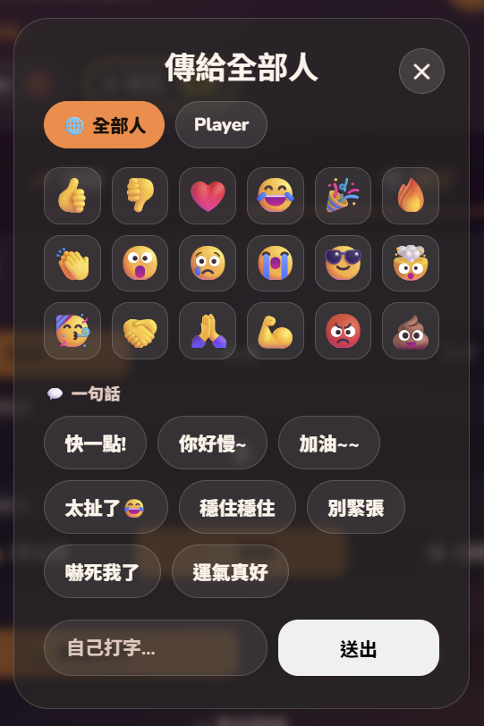
  &nbsp;
  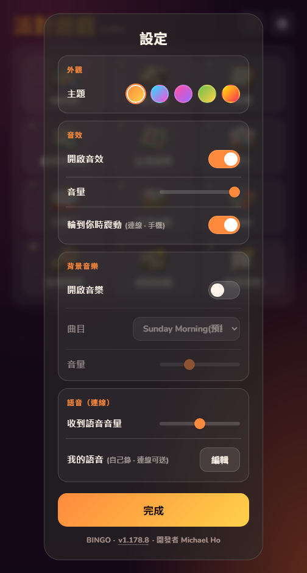

### 🎯 一個人也能玩

十二款裡有十一款可以單機遊玩，其中七款（五子棋、台灣麻將、排七、大老二、台式 21 點、UNO、象棋暗棋）配有**電腦對手**，其餘是單人解謎 / 練習；五子棋還能兩個人**輪流點同一支手機**下。安裝成 App 後**離線也能玩**。

### 🎨 個人化與體驗

- **五種主題**配色，設定會自動記住。
- **音效 · 背景音樂 · 語音音量**分別可調，背景音樂可選曲目。
- **輪到你時震動**（連線 · 手機）。
- **「大 / 小」** 一鍵收掉周邊 UI，把棋盤 / 牌桌 / 畫板放到最大。
- **全螢幕模式**：適合投影到大螢幕帶全場玩。
- **PWA**：可「加到主畫面」像 App 一樣開，並支援離線遊玩。

---

## 🕹️ 怎麼開始

1. 打開網頁，從主選單挑一款遊戲。
2. 選 **🌐 連線對戰**：輸入暱稱 → **建立房間**，或直接從列表**加入朋友的房間**。
3. 或選 **🎮 單機遊玩**：一個人跟電腦或自己玩（你畫我猜沒有這個選項）。
4. 房主決定規則、大家按「準備好了」，開始！ 🎉

---

## 🔖 關於

- **技術**：純 HTML / CSS / JavaScript 前端網頁，**無建置流程**；多人連線採用 Firebase Realtime Database，不需要後端伺服器，也不需要安裝任何東西。
- **關鍵字**：多人連線遊戲 / 團康遊戲 / 派對遊戲 / 賓果 Bingo / 五子棋 / 數獨 / 麻將 / 台灣16張麻將 / 排七 / 大老二 / 21點 / UNO / 暗棋 / 成語接龍 / 你畫我猜 / online multiplayer party games。

Made with ❤️ by Michael Ho
